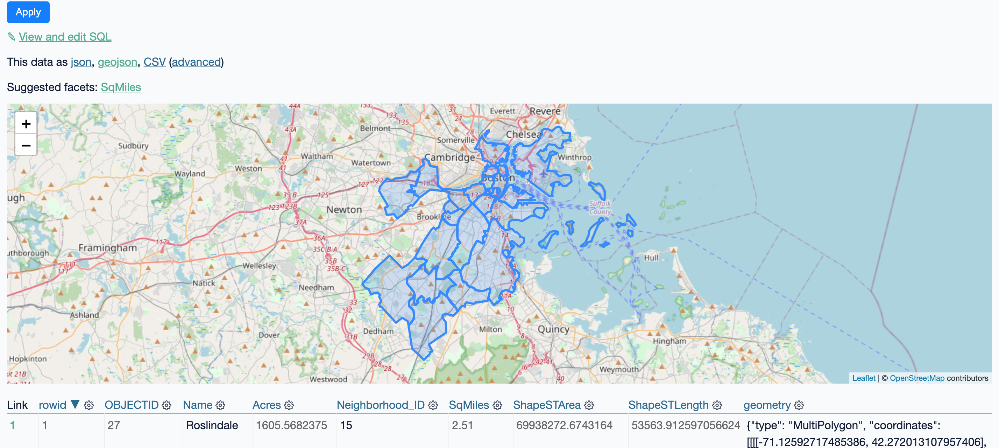

# datasette-geojson-map

[](https://pypi.org/project/datasette-geojson-map/)
[](https://github.com/eyeseast/datasette-geojson-map/releases)
[](https://github.com/eyeseast/datasette-geojson-map/actions?query=workflow%3ATest)
[](https://github.com/eyeseast/datasette-geojson-map/blob/main/LICENSE)

Render a map for any query with a geometry column

## Installation

Install this plugin in the same environment as Datasette.

    $ datasette install datasette-geojson-map

## Usage

Start by loading a GIS file.

For example, you might use [geojson-to-sqlite](https://pypi.org/project/geojson-to-sqlite/) or [shapefile-to-sqlite](https://pypi.org/project/shapefile-to-sqlite/) to load [neighborhood boundaries](https://bostonopendata-boston.opendata.arcgis.com/datasets/3525b0ee6e6b427f9aab5d0a1d0a1a28_0/explore) into a SQLite database.

```sh
wget -O neighborhoods.geojson https://opendata.arcgis.com/datasets/3525b0ee6e6b427f9aab5d0a1d0a1a28_0.geojson
geojson-to-sqlite boston.db neighborhoods neighborhoods.geojson --spatial-index # create a spatial index
```

(The command above uses Spatialite, but that's not required.)

Start up `datasette` and navigate to the `neighborhoods` table.

```sh
datasette serve boston.db --load-extension spatialite

# in another terminal tab
open http://localhost:8001/boston/neighborhoods
```

You should see a map centered on Boston with each neighborhood outlined. Clicking a boundary will bring up a popup with details on that feature.



This plugin relies on (and will install) [datasette-geojson](https://github.com/eyeseast/datasette-geojson). Any query that includes a `geometry` column will produce a map of the results. This also includes single row views.

## Development

To set up this plugin locally, first checkout the code. Then create a new virtual environment:

    cd datasette-geojson-map
    python3 -mvenv venv
    source venv/bin/activate

Or if you are using `pipenv`:

    pipenv shell

Now install the dependencies and test dependencies:

    pip install -e '.[test]'

To run the tests:

    pytest

```

```
